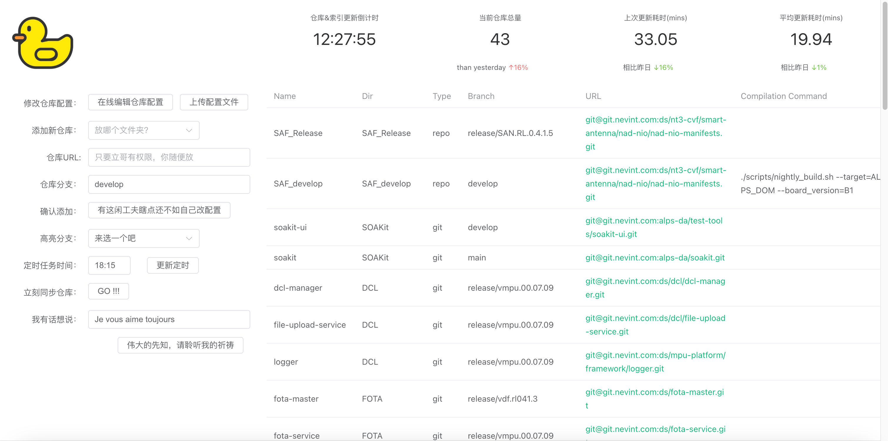
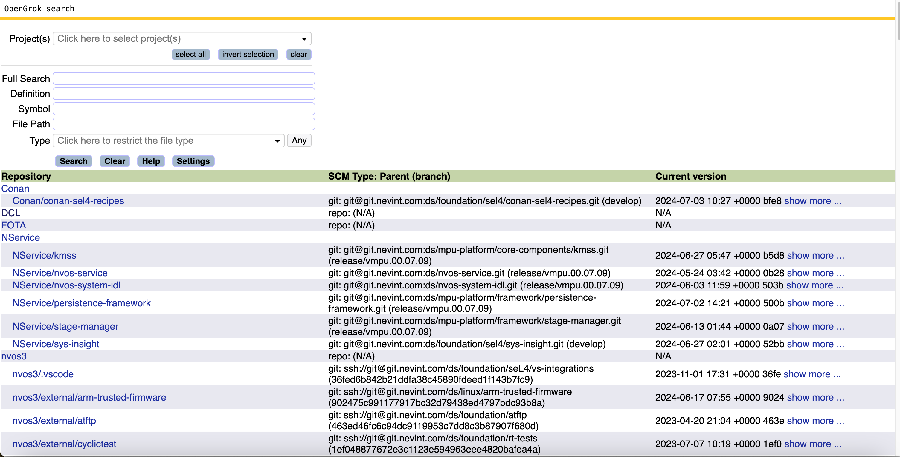

# Repo Pool: A simple tool for synchronising repos

## Purpose

Initialise/synchronise repositories to better view code in Gork env (ref: https://nio.feishu.cn/docx/Ipdnd8mjgo9fIKxKWI0ca8OdnWc).

## Usage

### GUI

You're allowed to access the sites via the user chat group. A notification will be sent every time a synchronization is triggered.


You shall first configure your synchronisation settings before looking throught the source code



You are then able to browse the source code freely! Enjoy :D



### CMD

Running with the following command:

```bash
python RepoPool.py -w [root dir for repos] -a &
```

All repositories configured in the *repos.json* will be synchronised up to date at 2:00 am (Timezone: Asia/Shanghai).

The following arguments can be accepted to change the settings:

- -w (required): specify the root dir for all repos
- -c: json configuration file path
- -a: synchronisation is applied to all repos
- -A: synchronise immediately
- -t: time to perform synchronisation, format: *HH:MM*. For example: 2:00

## Configuration

There are 2 types of repos that can be accepted: repo project and git project.

### Repo

All of the following attributes shall be configured to trace a repo project:

- name:	dir name for the repo
- type: 	specify "repo"
- branch:	as it means
- manifest:	the synchronisation target manifest file
- url:		git url
- compile_cmd: compilation command

Let's see an example:

```json
    "SAF": {
        "name": "SAF",
        "type": "repo",
        "branch": "release/SAN.RL.0.2.0.3",
        "manifest": "default.xml",
        "url": "git@githost.nevint.com:ds/nt3-cvf/smart-antenna/nad-nio/nad-nio-manifests.git",
	"compile_cmd": "./scripts/nightly_build.sh --target=ALPS_DOM --board_version=B1"
    }
```

For the example above, the compilation command will be run after the repo is synchronised.

Note that *compile_cmd* is an optional segment, you can ignore it if compilation is not wanted.

### Git

"branch" is alternative for Git repository configurations, the outer branch is the default branch to check out to when a nested repo's branch is not specified.

In the following examples, 3 git repositories will be initialised and updated every night.

Respectively, they will be checked out to branch:

- dcl-manager:			release/vmpu.00.06.02
- file-upload-service:		release/vmpu.00.06.02
- logger:				release/vmpu.00.06.04

The compilation command *compile_cmd* has the same effect as *branch*.

Respectively, the compilation command for each repo is:

- dcl-manager:			make dcl
- file-upload-service:		make
- logger:				make

```json
    "DCL":{
        "name": "DCL",
        "type": "git",
        "branch": "release/vmpu.00.06.02",
	"compile_cmd": "make",
        "repos": [
            {
                "branch": "release/vmpu.00.06.02",
                "url": "git@githost.nevint.com:ds/dcl/dcl-manager.git",
		"compile_cmd": "make dcl"
            },
            {
                "url": "git@githost.nevint.com:ds/dcl/file-upload-service.git"
            },
            {
                "branch": "release/vmpu.00.06.04",
                "url": "git@githost.nevint.com:ds/mpu-platform/framework/logger.git"
            }
        ]
    }
```

Note that git repositories and repo project repositories can share a single dir, as long as you specify their names to be the same. For example:

```json
    "Vdf-manifests": {
        "name": "Vdf",
        "type": "git",
        "branch": "develop",
        "repos": [
            {
                "branch": "develop",
                "url": "git@githost.nevint.com:ds/vdf/vdf-sel4.git"
            }
        ]
    },
    "Vdf-seL4": {
        "name": "Vdf",
        "type": "repo",
        "branch": "release/vdf.rl020.1",
        "manifest": "vdc-sel4.xml",
        "url": "git@githost.nevint.com:ds/vdf/vdf-manifests.git"
    }
```

*Vdf-manifests* is a git repository, whilst *Vdf-seL4* is of type repo.

However, since they both specify "Vdf" as their "name". As a result, they will both locate at: *[workspace]/Vdf/*

## Prospective

For bugs reporting or new requirements to be implemented, please contact: Erwei Luo

You feedback is important to us, pls don't hesitate to contact me if there's anything that I can help with. Merci beaucoup:)
